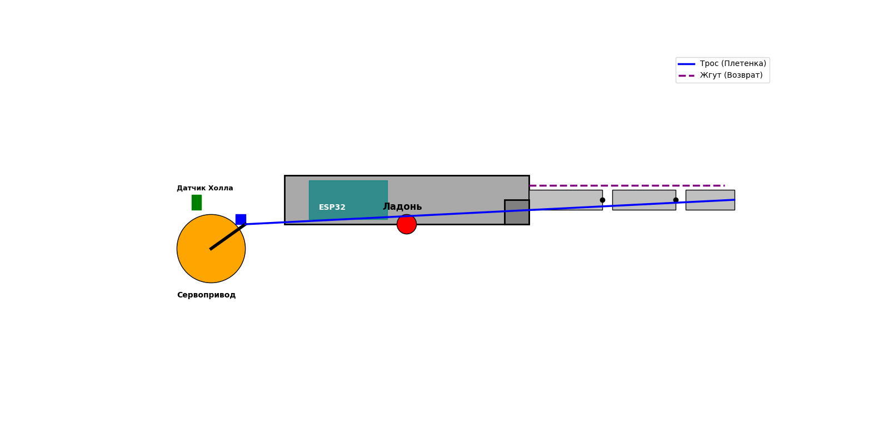

# Роботизированная кисть руки

## 1. Общее описание проекта
Проект представляет собой прототип четырехпалой роботизированной кисти с системой адаптивного захвата. Три пальца являются активными и подвижными, а один (большой) палец — стационарный квадратный упор. Управление осуществляется через Wi-Fi или напрямую по протоколу ESP-NOW.

## 2. Механическая конструкция и материалы

* **Корпус:** Фаланги и ладонь изготавливаются методом 3D-печати из пластика PLA.
* **Сборка:** Все элементы скрепляются с помощью цианакрилатного клея-геля, усиленного пищевой содой в местах нагруженных соединений для создания сверхпрочного композита.
* **Тяга:** Плетеный рыболовный шнур *PowerPro 0.6 мм*, обеспечивающий минимальное растяжение и высокую износостойкость.
* **Возврат:** Силиконовые жгуты на тыльной стороне фаланг.
* **Шарниры:** Складные петли.

## 3. Электронная архитектура и обратная связь
* **Контроллер:** *ESP32 NodeMCU*.
* **Датчик состояния:** Система на основе неодимовых магнитов и линейных датчиков Холла (*SS49E*). Магнит крепится на качалку сервопривода, а датчик Холла — неподвижно на корпусе. Контроллер отслеживает изменения магнитного поля: если при подаче ШИМ-сигнала данные датчика перестают меняться, система фиксирует упор или заклинивание и отключает привод.
* **Датчик события:**  Тактовая кнопка с демпфером на нижней грани ладони для регистрации контакта с объектом.
## 4. Комплектующие и их стоимость
Цены основаны на среднем значении по популярным российским маркетплейсам (Ozon, Wildberries) и специализированным магазинам электронных компонентов (Чип и Дип) на июнь 2026 года.

1. Микроконтроллер ESP32 NodeMCU, 1 шт, 510 ₽
2. Сервопривод MG996R, 3 шт, 550 ₽
3. Датчик Холла SS49E, 3 шт, 50 ₽
4. Неодимовые магниты, 3 шт,30 ₽
5. Тактовая кнопка, 1 шт,30 ₽
6. Плетеный шнур (PowerPro 0.6 мм), 3 шт, 350 ₽
7. Складные петли 56x15x2 мм, 6 шт, 98 ₽
8. Силиконовый жгут, 3 шт,  200 ₽
9. Блок питания 5В (8А), 1 шт, 900 ₽
10. Цианакрилатный клей-гель, 1 шт, 100 ₽

    ИТОГО: 5 668 ₽
